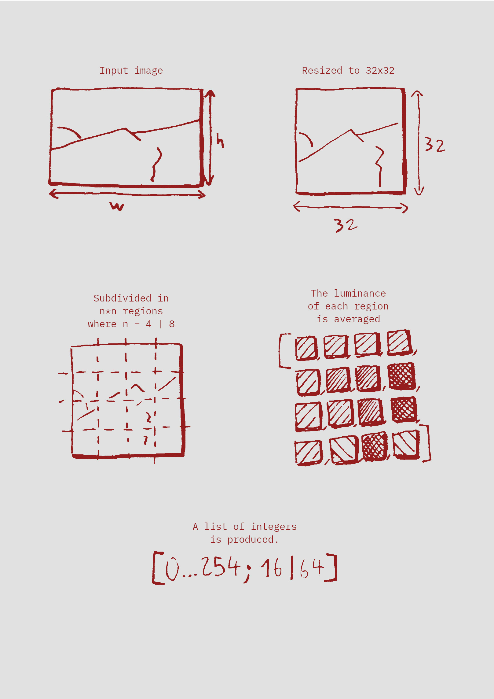

# Imago

Bindings (for my usage) to image-rs/image. Mainly because I didn't find any Elixir/Erlang library to iterate over pixels of compressed formats like Jpeg.
I'll need to at least open/process a bit/save images from rust.

At the time of this writing, it supports only two things : 
 - getting a `Vec<u8>` of r/g/b/a, rgb, or rgba pixels
 - getting a `Vec<u8>` **that represents a luminance fingerprint**.

```elixir
iex> Imago.read_pixels("/path/to/image.jpg|png|gif|ico|bmp|tiff") # Image formats are those of image-rs/image
{:ok,
 [131, 140, 157, 255, 130, 139, 156, 255, 131, 138, 156, 255, 131, 138, 156,
  255, 134, 139, 158, 255, 134, 139, 158, 255, 136, 139, 158, 255, 135, 138,
  157, 255, 135, 136, 156, 255, 135, 136, 156, 255, 136, 137, 157, 255, 136,
  137, 157, 255, ...]}

iex(1)> Imago.get_fingerprint_4x4("/path/to/image.jpg")
{:ok,
 [132, 138, 103, 110, 138, 119, 112, 125, 127, 121, 120, 133, 134, 125, 131,
  139]}
  
iex(1)> Imago.get_fingerprint_8x8("/path/to/image.jpg")
{:ok,
 [113, 144, 157, 115, 100, 102, 106, 109, 130, 141, 169, 112, 103, 107, 113,
  114, 142, 143, 138, 108, 108, 112, 120, 123, 128, 139, 120, 112, 112, 115,
  129, 126, 130, 126, 124, 117, 116, 120, 130, 133, 132, 122, 123, 119, 120,
  124, 129, 137, ...]}

iex> Imago.read_pixels("/this/one/does/not/exist")
:error

iex> Imago.read_pixels("/this/one/is_a_text_file.txt")
:error
```

#### Luminance fingerprinting is done that way :
 
 


#### Available utilities:

```elixir
iex> Imago.read_pixels("x.jpg")
  {:ok, [r, g, b, a, r, g, b, a]}  

iex> Imago.read_pixels_rgba("x.jpg")
  {:ok, [r, g, b, a, r, g, b, a]}     

iex> Imago.read_pixels_rgb("x.jpg")
  {:ok, [r, g, b, r, g, b]}     

iex> Imago.read_pixels_red("x.jpg")
  {:ok, [r, r, r]}  

iex> Imago.read_pixels_green("x.jpg")
  {:ok, [g, g, g]}  

iex> Imago.read_pixels_blue("x.jpg")
  {:ok, [b, b, b, b]}   

iex> Imago.read_pixels_alpha("x.jpg")
  {:ok, [a, a, a, a]}

iex(1)> Imago.get_fingerprint_4x4("/path/to/image.jpg")
{:ok,
 [l, l, l, l,
  l, l, l, l,
  l, l, l, l,
  l, l, l, l]} # where l = luminance
  
iex(1)> Imago.get_fingerprint_8x8("/path/to/image.jpg")
{:ok,
 [l, l, l, l, l, l, l, l,
  l, l, l, l, l, l, l, l,
  l, l, l, l, l, l, l, l,
  l, l, l, l, l, l, l, l,
  l, l, l, l, l, l, l, l,
  l, l, l, l, l, l, l, l,
  l, l, l, l, l, l, l, l,
  l, l, l, l, l, l, l, l
 ]} # where l = luminance
```